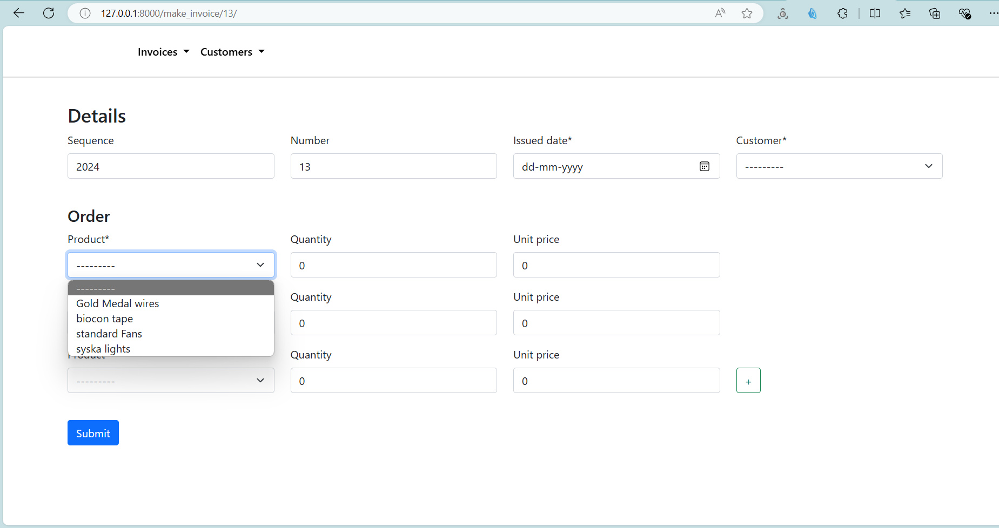
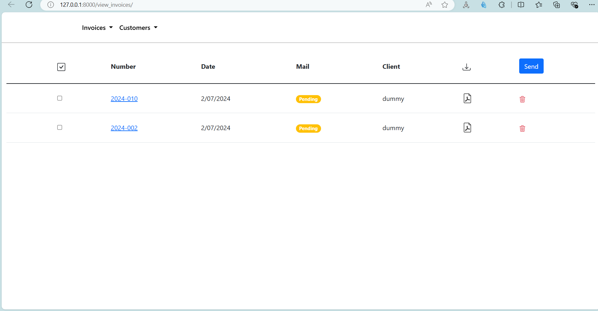
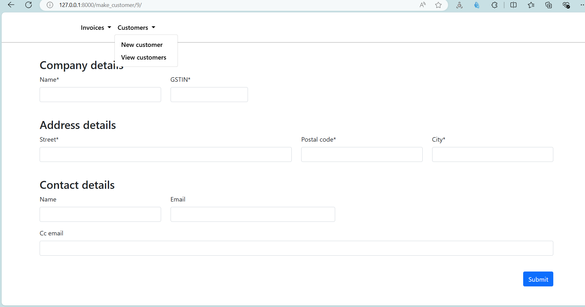
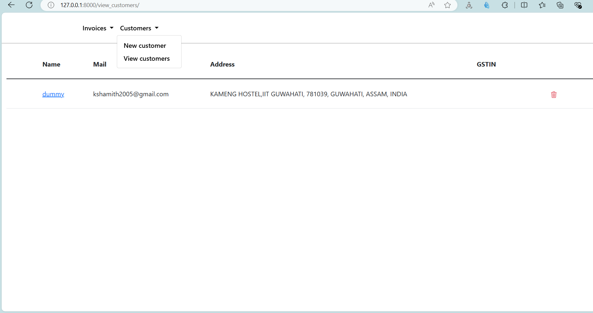
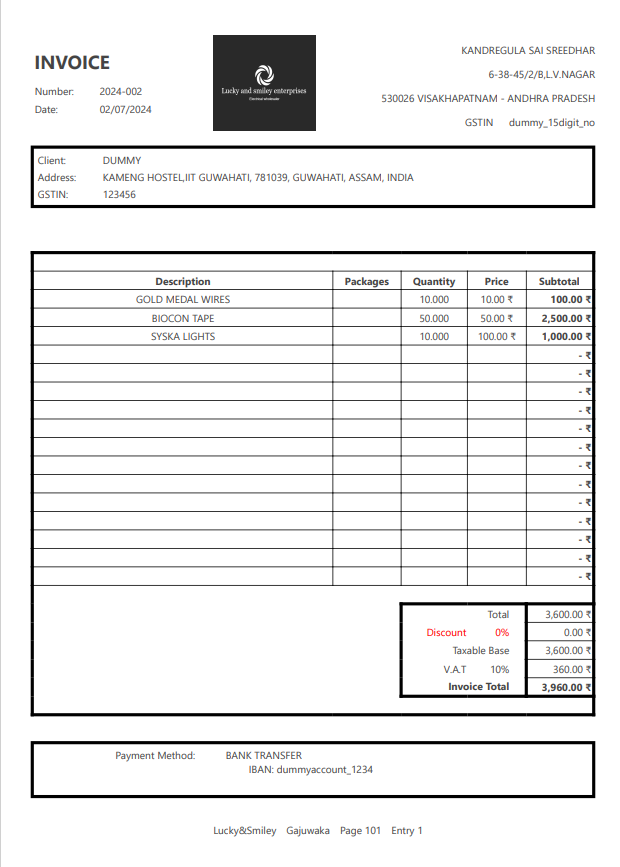

# Invoicing App for Small Businesses

This Django-based application simplifies the invoicing process for small businesses. It provides features for creating, editing, printing, and emailing professional-quality invoices, along with basic inventory management and client data storage.

## Key Features

* Streamlined invoice creation, editing, and printing.
* Generation of professional-quality PDF invoices.
* Integrated email functionality for seamless invoice delivery.
* Inventory management features to keep track of products/services.
* Client data management.

## Technologies Used

* Django (Backend Framework)
* HTML, Bootstrap (Frontend)
* smtplib (Email Sending)
* WeasyPrint (PDF Generation)

## Installation and Setup

This project is set up like a standard Django project. Follow these steps to run it locally:

1. **Clone the repository:** `git clone https://github.com/shamith20052005/Invoicing_app_for_small_businesses.git`
2. **Navigate to the project directory:** `cd Invoicing_app_for_small_businesses`
3. **Create a virtual environment:** `python -m venv venv`
4. **Activate the virtual environment:**
   - On Windows: `venv\Scripts\activate`
   - On macOS/Linux: `source venv/bin/activate`
5. **Install the dependencies:** `pip install -r requirements.txt`
6. **Apply migrations:** `python manage.py migrate`
7. **Create a superuser:** `python manage.py createsuperuser`
8. **Start the development server:** `python manage.py runserver`

## IMAGES OF MY WEBSITE

Here are some screenshots of the application:

